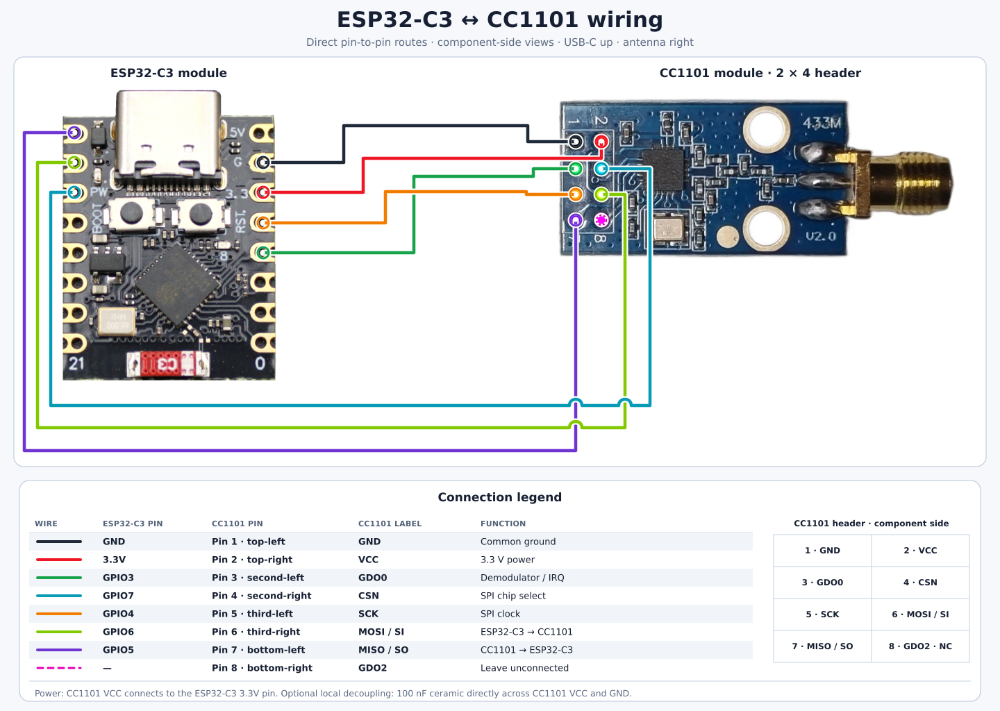

# revivint firmware (ESP32-C3 + CC1101)

Receive Honeywell/2GIG/**Vivint 345 MHz** door/window sensors with a **CC1101** on an **ESP32-C3**, decode them in `no_std` Rust, and publish open/closed (plus heartbeat/startup) to **MQTT**.

**Two decode strategies** live in this one crate, selected by a Cargo feature, so you can compare them head-to-head (behaviour, robustness, energy).
Everything else — bring-up, the radio driver, Wi-Fi, MQTT, Home Assistant discovery — is shared code, so the two builds differ *only* in how bits come off the air:

| | `--no-default-features --features sw` | `--features hw` *(default)* |
|---|---|---|
| RF + OOK demod | radio | radio |
| Bit/chip timing | MCU (times every edge via RMT) | **radio** |
| Sync detection | MCU (searches for `FFFE`) | **radio** (chip-encoded sync) |
| Packet buffering | none — per-edge interrupts | **radio** (64-byte FIFO) |
| Manchester decode | MCU | MCU (~160 chips/packet) |
| Framing, CRC, keystream | MCU | MCU |
| Measured event yield | ~50% | **100%** |
| Purpose | debugging: the only mode that reports raw edge timings | the production receiver |

Manchester stays on the MCU in both.
The CC1101 *can* decode it, but it pairs chips and commits with no recovery path, so one mis-sliced chip loses the frame — measured at ~0 frames against 100% doing it on the MCU.

Enabling both, or neither, is a build error rather than a surprise on the bench.

Both paths run the **same tested decode core** (`revivint-core`, which also carries the CC1101 driver behind its `cc1101` feature), so they emit identical MQTT messages, and **both receive the 5817-style 96-bit families and the 5718-style 64-bit legacy family with one radio configuration** — the CRC decides which framing (and which bit polarity) a burst was.
Home Assistant MQTT discovery is published by default.

## Layout

```
revivint-core/     no_std core: types, CRC, frame parse, cipher, keymap,
                   Manchester/framer, MQTT+HA formatting (feature `mqtt`),
                   CC1101 driver + OOK register profiles (feature `cc1101`)
revivint/          the host CLI (crack / decode)
revivint-esp/      this crate — ESP32-C3 firmware (excluded from the workspace)
  src/main.rs        shared bring-up: heap, scheduler, Wi-Fi/MQTT, SPI, radio
  src/hw.rs          the `hw` receive loop (FIFO)
  src/sw.rs          the `sw` receive loop (RMT edge capture)
  src/net.rs         Wi-Fi + MQTT + Home Assistant discovery
```

`revivint-core` and `revivint` form one Cargo workspace in the `revivint-rs/` directory and build/test on your host.
This firmware crate is `exclude`d from it and pins the `riscv32imc-unknown-none-elf` target via its own `.cargo/config.toml`, so `cargo test` at the workspace root runs the whole host suite — including the CC1101 register math.

## Test the core (on your computer)

```bash
cargo test                       # runs the whole workspace suite (100 tests)
```

Coverage includes: CRC-16/0x8050 against firmware-derived values; every frame family decoded from real captured frames (legacy64, d0 startup, 7a contact, 72 heartbeat, 74 third-device); the channel-0x8 → poly-0x8005 path; bad-CRC rejection; the full software pipeline round-trip (`bytes → Manchester chips → RMT-style pulses → chips → framer → decode`); the sync-stripped FIFO path (`decode_body`) over both frame lengths and both bit polarities; the CC1101 frequency/data-rate register math and packet-mode configuration; the MQTT topic layout and Home Assistant discovery payloads; and the SPI driver framing via a recording fake SPI/CS.

## What gets decoded (protocol summary)

Confirmed against the captured RF archive **and** the sensor MCU firmware (MSP430G2452).
All families: `0xFFFE` sync, CRC-16 MSB-first poly `0x8050` (legacy "channel 0x8" uses `0x8005`).

- **`open` / `closed`** = bit `0x80` of the status byte (reed switch).
- **counter** (bytes 3-4 of `0x7x`) increments once per open/close **event**.
- **`0xd0`** = power-on/startup beacon → "battery inserted / booted".
- **`0x72`** = heartbeat/supervisory (a panel infers "battery removed/dead" from its *absence*, since a battery sensor can't transmit on power loss).
- **`0x7a`** = the normal contact event.
- low status bits + byte-10 nibble are firmware whitening (in the clear, CRC'd, not flags).
  Tamper / low-battery: a 2nd switch input and the legacy `0x08` bit exist, but need targeted captures to characterise — unknown `0x7x` subtypes are surfaced as `EventClass::UnknownEvent` to make that easy.

## Wiring (typical)

CC1101 module ↔ ESP32-C3 (adjust to your board; any free SPI-capable pins work):

```
CC1101   ESP32-C3
 VCC  ->  3V3        (NOT 5V)
 GND  ->  GND
 SCLK ->  GPIO (SCLK)
 MOSI ->  GPIO (MOSI / SI)
 MISO ->  GPIO (MISO / SO)
 CSN  ->  GPIO (CS)
 GDO0 ->  GPIO  (`sw`: RMT capture input; `hw`: packet-ready interrupt)
 GDO2 ->  GPIO  (optional: carrier-sense wake)
```

Use a 345 MHz-tuned antenna (≈ 21.7 cm quarter-wave whip) for improved range.



## Build & flash the firmware

```bash
# one-time: the RISC-V target + the flasher. Stable toolchain — no nightly.
rustup target add riscv32imc-unknown-none-elf
cargo install espflash

cd revivint-esp         # add --no-default-features --features sw for the SW path
VIVINT_KEYS='405817=0c5e' cargo build --release   # bake in this sensor's key
VIVINT_KEYS='405817=0c5e' cargo run   --release   # build + flash + monitor
```

`cargo run` uses the `espflash flash --monitor` runner from `.cargo/config.toml`.

### With Nix

From the repository root, one command builds and flashes the firmware, then opens the serial monitor:

```bash
cp .env.sample .env     # then fill it in; .env is git-ignored
source .env
nix run --impure .#flash
```

Or pass the settings inline:

```bash
WIFI_SSID=myssid WIFI_PASS=secret MQTT_BROKER_IP=192.168.1.10 \
VIVINT_KEYS='405817=0c5e' \
  nix run --impure .#flash
```

The settings are read at build time, and `--impure` is what lets the build see them.
Without `--impure`, or with any of the four required settings (`WIFI_SSID`, `WIFI_PASS`, `MQTT_BROKER_IP` and `VIVINT_KEYS`) unset, the build fails before compiling anything and names what is missing.
Plain `cargo build` under rustup is unaffected and falls back to the placeholder defaults in the source.
The optional settings in [Configuration](#configuration-1) pass through the same way when set.
Extra arguments go to `espflash flash`, and `nix run .#monitor` reattaches to the serial console.
`espflash` finds the board itself, or reads `ESPFLASH_PORT` when more than one is connected.

The values end up in the build's derivation, which any user of the machine can read from the Nix store.
On a shared machine, use the rustup route above instead.

`nix develop` adds `espflash`, `lld`, `rust-analyzer` and `rustfmt` to the shell.
Cargo and rustc still come from rustup, which installs the target and `rust-src` that `rust-toolchain.toml` asks for, so `cargo run --release` in this directory works as described above.
The Nix package, by contrast, uses nixpkgs' `rustc`, which ships no prebuilt `core` for this chip.
It therefore sets `RUSTC_BOOTSTRAP=1` and Cargo builds `core` from source, as `.cargo/config.toml` describes.

### Configuration

**`VIVINT_KEYS` is the only setting a production build has.**
Everything about the RF path — sync word, data rate, AGC, decision boundary, bandwidth, carrier sense — was determined experimentally on hardware and is compiled in.
Sensors that need no seed (the 64-bit legacy family carries its status in the clear) need no configuration at all.

RF tuning knobs still exist, but only in a `diag` build, and they are bench instruments for re-running the sweep on different hardware rather than user configuration.
Each is an env var read at build time and named in `revivint-esp/src/main.rs`; `revivint_core::cc1101::config::Squelch` lists the fields they set and the values this hardware settled on.

### The keystream key (contact decode): `VIVINT_KEYS`

The sensor whitens its status byte with a per-device 16-bit keystream, so a naive "bit 7 = open" read is only ~99% right.
Recover the sensor's seed **once, offline** with the `revivint crack` tool (in `../revivint`), from an RTL-SDR/rtl_433 capture, then bake the `txid=seed` mapping it prints into the firmware at build time via `VIVINT_KEYS`.
The firmware builds a per-device `revivint_core::cipher::Decoder` for each entry and reports the **exact** open/closed state — no key handled at runtime.

**A keyed sensor with no seed now reports nothing rather than something wrong.**
Its status byte stays `revivint_core::Status::Sealed`, which carries no decoded bits at all, so the contact entity is never published for it and the log says so explicitly:

```
rx id=63139 event=contact counter=25 status=d8 (keyed, no seed)
```

### Home Assistant shows sensors that are not mine

Two separate causes, and they need different fixes.

**Strangers you really are receiving.**
Expected on a shared band.
Discovery is limited to declared devices, so this should not happen on a current build; if you want to survey what is on the air, build with `HA_DISCOVERY=all`, read the TXIDs off the broker, put yours in `VIVINT_KEYS`, and turn it back off.
Undeclared senders are still decoded and still published to `vivint/<id>/...` either way — they just do not become HA devices.

**Fossils from an older build.**
Discovery configs are published **retained**, so a device announced by earlier firmware persists on the broker, and in Home Assistant, indefinitely.
Reflashing does not clear them; only an empty retained payload on the same topic does:

```bash
./purge-ha-devices.sh -h broker.lan --keep 405817,405718           # dry run
./purge-ha-devices.sh -h broker.lan --keep 405817,405718 --apply
```

Earlier builds decoded loop-1 straight out of that ciphertext and published it, which is why the guidance used to be "set it to your sensor **or the contact state will be wrong**".
The failure is now visible instead of plausible.
If `VIVINT_KEYS` is unset it defaults to the reference unit `405817=0x0c5e`, so a different sensor will show as sealed until you set it.

### `VIVINT_KEYS` declares your devices, keyed or not

Entries are comma-separated, and there are three shapes:

| entry | meaning |
|---|---|
| `405817=0c5e` | a keyed sensor and its seed |
| `405718` | a **declared** sensor that needs no seed (64-bit legacy) |
| `+legacy` | also accept legacy senders you did **not** list |

The separator is `=`, mirroring `rtl_433`'s own `txid=seed` spelling.
Nested inside a quoted environment assignment it is unambiguous to the shell, so `VIVINT_KEYS='405817=0c5e'` exports fine.
`:` is accepted too.

**Declaring is not the same as keying.**
A legacy sensor's status byte is in the clear, so it needs no seed — but it still has to be listed, because the list is also what stops a stranger's frame being believed. 345 MHz is a shared band (2GIG, Honeywell, Resideo), so a receiver that works hears the neighbourhood.

Why the list gates decoding at all: a frame found by a real sync match is corroborated by that sync and is always reported.
A frame recovered by the **sync-less rescue fallback** has only a CRC behind it, and that path gets about a thousand attempts per capture (16 phases x 2 polarities x ~34 bit offsets), which turns a 1-in-65536 check into roughly 1-in-60.
Measured against unrelated valid-Manchester traffic, the ungated fallback fabricated a frame from **0.092%** of bursts, each with a fresh random TXID — and auto-discovery turned every one into a Home Assistant device.
Requiring a declared TXID takes that to **zero** (`revivint-core/tests/phantom_devices.rs` measures both).

`+legacy` re-opens that door on purpose, for anyone who wants undeclared legacy sensors.
The firmware does not take it at face value: an undeclared legacy TXID must be heard **twice within one burst** before it is believed.
A real sensor sends each event about six times 129 ms apart; a fabricated one never comes back (259 measured phantoms, 259 distinct TXIDs, no repeats).

`VIVINT_KEYS` is the **single** knob — there is no separate seed, allowlist, or device variable.
It takes whatever `revivint crack` printed, pasted in unchanged, and a comma joins several sensors:

```bash
VIVINT_KEYS='0019-050-7610=05c9,0019-050-7743=dda9' cargo run --release
```

The TXID is accepted in every spelling the tooling uses, all the same device:

| form | example |
|---|---|
| decimal | `405817` |
| `0x`-hex | `0x63139` |
| sensor label | `0056-040-5817` |
| compact label | `0056-0405817` |

**Seeds in `VIVINT_KEYS` are hex** (`05c9` or `0x05c9`), matching what `crack` prints.
A malformed entry fails the build with a named error rather than baking in a wrong key.

Up to `KEY_CAP` (8) keyed sensors fit; each costs ~768 B of RAM for its running cipher.
Bump it in `revivint-core/src/cipher.rs` for a larger install.

A sensor that broadcasts a `0x73` seed-announce at power-up (pull and reinsert the battery in range of the receiver) is learned at **runtime** and needs no build-time key at all.
Legacy 64-bit (5718-style) frames carry contact, battery and tamper in the clear, so those sensors never need a seed.

To produce a flashable image without a board (CI / sanity check):

```bash
espflash save-image --chip esp32c3 --merge \
  target/riscv32imc-unknown-none-elf/release/revivint-esp /tmp/revivint-esp.bin
```

### Known-good version matrix (verified to build, 2026-08)

The esp-rs ecosystem reorganised after esp-hal 1.0: **`esp-hal-embassy` became `esp-rtos`** (a scheduler that also backs the radio) and **`esp-wifi` became `esp-radio`**.
This tree tracks the current set:

| crate | version | note |
|---|---|---|
| `esp-hal` | `1.1` + `unstable` | current stable line |
| `esp-rtos` | `0.3` (`embassy`, `esp-radio`, `esp-alloc`) | replaces `esp-hal-embassy`; **must be started before any radio call** |
| `esp-radio` | `0.18` (`wifi`, `esp-alloc`) | replaces `esp-wifi` |
| `embassy-executor` | `0.10` | provided by esp-rtos — do **not** enable any `arch-*`/`executor-*` feature |
| `embassy-time` | `0.5` | matches embassy-executor 0.10 |
| `embassy-net` | `0.9` | `embedded-io-async 0.7`, `heapless 0.9` |
| `rust-mqtt` | `0.5` | full rewrite of 0.3, with the MQTT-5 will/retain support the HA availability topic and discovery configs need |
| `esp-alloc` | `0.10` | heap for esp-radio *and* rust-mqtt's `AllocBuffer`. **Must match esp-radio/esp-rtos's own dependency** — see the alloc-failure note below |
| `esp-println` / `esp-backtrace` | `0.18` / `0.20` | `log-04` feature unchanged |
| `esp-bootloader-esp-idf` | `0.5` | provides `esp_app_desc!()` |
| `portable-atomic` | `1` (`hw`) | riscv32imc has no atomic RMW; backs the RX counters |

**The task arena is gone.** embassy-executor 0.9 dropped the global `TASK_ARENA_SIZE` (the thing you had to raise past 8192) in favour of per-task static allocation, so there is no `task-arena-size-*` feature or `EMBASSY_EXECUTOR_TASK_ARENA_SIZE` to tune any more — a task either fits at compile time or the spawn returns `Err`.

Also required (already set): `.cargo/config.toml` rustflags include `-C link-arg=-Tlinkall.x` (esp-hal's linker script provides the RISC-V interrupt-vector defaults).
`run()` sets `CpuClock::max()` — esp-radio requires ≥ 80 MHz — and starts `esp_rtos` before touching the radio.

## Calibration

Most of what used to need a bench session is now decided by the CRC at runtime:

* **Frame length** — the radio collects `BODY_MAX` (10) bytes after the sync and `decode_body` tries the 96-bit framing then the 64-bit legacy framing, keeping whichever passes CRC.
  One configuration receives **both** sensor families.
* **Byte polarity** — `decode_body_auto` (`hw`) and both Manchester polarities (`sw`) are tried per burst.
  No `invert` flag to set.

The one knob left in `hw` is the **sync word**, because that comparison happens inside the CC1101: the sensors' preamble is `0xFFFE`, but if your OOK slicer settles inverted it arrives as `0x0001`.

```bash
# The sync word is compiled in (measured on hardware). To try the other OOK
# polarity you need a diag build, which is where the RF knobs live:
VIVINT_SYNC=0xaaa9 cargo run --release --no-default-features --features hw,diag
```

If range or sensitivity is poor, tune the AGC/bandwidth registers in `revivint_core::cc1101::config` (`AGCCTRL*`, and the `MDMCFG4` high nibble = RX bandwidth).

### Nothing in the log when you open/close a sensor?

You *should* see one `rx id=… event=contact counter=… contact=…` line per event — `ESP_LOG=info` is set in `.cargo/config.toml`, so if the boot banner prints, the logger is working.
The `hw` build also logs a receive summary every 60 s:

```
rx: 128 sync matches, 126 CRC-valid frames     # healthy
rx: no sync matches yet — …                    # the radio never fired
rx: 41 sync matches, 0 CRC-valid frames        # hearing bursts, framing wrong
```

* **`no sync matches`** — the CC1101 is never matching the preamble.
  Check GDO0 wiring and the antenna.
  The sync word is compiled in and measured; to test the other OOK polarity, build with `--features hw,diag` and set `VIVINT_SYNC=0xaaa9` (the compiled-in default is `0x5556`).
* **`sync matches` but no frames** — the `rx: N undecodable bytes [..]` warnings print the raw FIFO contents; compare them against a known frame.
  Only *full-length* captures are reported this way: a capture shorter than the smallest possible body cannot hold a frame at all, so it is counted as `short` in the summary instead of warned about.
  See below.
* Rebuild with **`--no-default-features --features sw`** to see the problem from the other end: it logs every burst and does the framing in software, so it is the better bring-up tool.

### Frames decode as `id=00000 event=legacy contact=closed loop2=closed`

A flood of identical frames for device `0x00000` is **not** a decode — it is an empty or preamble-filled FIFO passing the legacy CRC.
Two things cause it, and both are fixed in this tree:

* **`MDMCFG2` `SYNC_MODE` must be `2` (16/16), not `3` (30/32).** 30/32 expects the sync word sent *twice* and tolerates two wrong bits, so against these sensors' run of preamble ones `FFFF FFFE` scores 31/32 against the expected `FFFE FFFE`.
  Sync then fires one bit early, inside the preamble, and the packet engine captures preamble instead of payload.
  `cc1101::config::sync_mode()` exposes the field and a test pins it.
* **A CRC pass is not enough.**
  The 64-bit legacy check is CRC-16 with a **zero init**, and a zero-init CRC over all-zero data is zero — so a buffer of `0x00` matches its own stored CRC and decodes as device `0x00000` (an all-`0xff` buffer does the same once the auto-polarity pass inverts it).
  Callers working from raw radio bytes must gate on `DecodedFrame::is_trustworthy()` (`crc_ok` **and** a non-zero TXID), which `decode_body` and `for_each_frame` now do.

To see what is really arriving, raise the log level in `.cargo/config.toml`:

```toml
[env]
ESP_LOG = "debug"      # logs the raw FIFO bytes of every packet
```

At `info`, un-decodable payloads are still reported once per distinct pattern (`rx: 22 undecodable bytes [ff, ff, ...]`) with repeats collapsed, and the 60 s summary counts them:

```
rx: 257 syncs, 257 captures, 228 frames, 0 undecodable, 12 partial, 17 short, 0 overflows
rx quality: 228/228 clean (100%), corrected: 0 early-trigger (worst +0 chips), 0 chip-phase, 0 polarity, 0 bit-offset
```

`partial` and `short` are both burst tails — the radio re-arms mid-burst and re-syncs on a packet it already delivered.
`short` never had enough bytes to try; `partial` cleared that floor but the burst stopped before the FIFO filled.
Both are normal.
`undecodable` is the one that matters: a **full-length** capture that decoded to nothing.

### Reading `rx quality`

Yield ("did we get the event") and quality ("how hard was it") are different questions, and only the second degrades *early*.
A receiver scraping frames out of a marginal signal still reports 100% of events, because the decoder keeps rescuing them — right up until it cannot.
`clean` is the number that moves first.

| field | meaning | if it grows |
|---|---|---|
| `clean` | needed no correction at all | — |
| `early-trigger` | a preamble bit error matched the sync pattern, so the radio fired before the frame; the real sync was found by scanning forward | normal in small numbers; `worst +N chips` is how much capture slack is actually being used |
| `chip-phase` | the Manchester chip stream was offset. A one-chip shift is still *locally valid* Manchester, so only the CRC catches it | falling SNR, or a data rate slightly off |
| `polarity` | the chip stream arrived in the *opposite* polarity from the one the sync word implies | should be ~0. Which polarity is normal is derived from `SYNC_WORD_CHIPS`, so this counts deviation, not convention — non-zero means a slicer on its decision boundary |
| `bit-offset` | the body did not start where expected within its run | usually accompanies the above |

The corrections are **not exclusive** — one marginal frame can need several, and which ones co-occur is the diagnostic.

### `short` captures in the summary

`short` counts captures with fewer bytes than the smallest body a frame can have.
They are **normal and not a fault**: after the packet engine delivers a frame it re-arms immediately, still inside the sensor's burst, and matches the sync word again on the tail of the packet it just handed over.
The FIFO then holds five to ten bytes of preamble and stops, and the capture timeout reads out the remainder.
(That timeout is derived from how long a full capture physically takes — `4 x CAPTURE_BYTES x 8 x CHIP_US`, about 94 ms — rather than picked, so the radio is back in RX before the sensor's next repeat 129 ms later.)

There is nothing to decode there — ten bytes of Manchester chips is 40 data bits, and the shortest body is 48 — so `revivint_core::ChipCapture` refuses to be built from them and the receive loop counts them rather than reporting a decode failure.
A run at 100% event yield still shows a handful per minute.

Worry only if `short` dwarfs `frames`, which would mean the radio is re-triggering on noise rather than on burst tails.

### `memory allocation of N bytes failed` at boot

Two different causes produce this identical panic.
Check the second one first — its symptom is that **the reported size is tiny (4 bytes) and raising the heap changes nothing**.

**1. Two `esp-alloc` versions linked (the heap is never registered).**
esp-alloc keeps the heap in a crate-level `static HEAP`.
If your `esp-alloc` is semver-incompatible with the one `esp-radio`/`esp-rtos` depend on, Cargo links *both*: `heap_allocator!` registers your regions into *your* copy, while esp-rtos and esp-radio allocate through *their* copy — which has **no regions at all**, so every allocation fails no matter how small.

```bash
cargo tree --duplicates | grep esp-alloc     # must print nothing
```

Keep `esp-alloc` pinned to whatever `esp-radio`/`esp-rtos` require (currently `0.10`).
To confirm in the linked image, there must be exactly one:

```bash
nm target/riscv32imc-unknown-none-elf/release/revivint-esp | grep 9esp_alloc4HEAP
```

**2. The heap is genuinely too small.**
esp-radio's Wi-Fi init is allocation-hungry (RX/TX buffer pools, the WPA supplicant) and esp-rtos allocates every task from the same heap.
`run()` uses the two regions esp-radio documents (100 KB total):

```rust
esp_alloc::heap_allocator!(#[ram(reclaimed)] size: 64 * 1024);  // bootloader RAM
esp_alloc::heap_allocator!(size: 36 * 1024);                    // dram_seg
```

The first reclaims the RAM the ESP-IDF bootloader used, which is otherwise wasted.
Right after the radio comes up the firmware logs

```
heap after radio init: 61234 used / 102400 total
```

so if you add features and run out again, you have a number to size against.

## MQTT (+ Home Assistant discovery)

`src/net.rs` is wired: **esp-radio** (STA) + **embassy-net** (DHCP/TCP) + **rust-mqtt**.
The decode loop hands each `DecodedFrame` to `net::report()` (a non-blocking channel `try_send`) and a dedicated `mqtt_task` drains the channel and publishes — so network latency and reconnects never stall the RF capture loop.

### Topics

For topic prefix `vivint` and sensor `0x63139`:

```text
vivint/status            "online"   (retained; "offline" is the MQTT will)
vivint/63139/state       {"id":"63139","event":"contact","state":"open","counter":25,...}
vivint/63139/contact     "open" | "closed"
vivint/63139/battery     "ok" | "low"
vivint/63139/tamper      "ON" | "OFF"
```

Each entity gets its **own** leaf topic rather than an HA template over the JSON.
A heartbeat frame carries no contact state, and a template reading a missing field would log errors and flap the entity; publishing a leaf only when the frame actually carries that value keeps entities stable.
The JSON `state` topic is attached to every entity as `json_attributes_topic` for the full detail.

### Home Assistant discovery (on by default)

Every sensor is announced the first time it is heard on a connection: three retained `binary_sensor` configs (contact = `door`, battery = `battery`, tamper = `tamper`) grouped under one HA device named for the decimal id printed on the sensor (`0x63139` → `Vivint 405817`).
Nothing to add to `configuration.yaml`.

```text
homeassistant/binary_sensor/vivint/63139_contact/config
homeassistant/binary_sensor/vivint/63139_battery/config
homeassistant/binary_sensor/vivint/63139_tamper/config
```

Set `HA_DISCOVERY=0` to publish only the plain topics.

### Configuration

All of it is read at **build time** from env vars (placeholder defaults in `net.rs`), so no secrets land in the binary unless you set them:

| env var | default | what it does |
|---|---|---|
| `WIFI_SSID` / `WIFI_PASS` | `CHANGEME-*` | station credentials |
| `MQTT_BROKER_IP` / `MQTT_BROKER_PORT` | `192.168.1.10` / `1883` | broker (dotted-quad; DNS isn't wired) |
| `MQTT_USER` / `MQTT_PASS` | unset | optional broker auth |
| `MQTT_CLIENT_ID` | `vivint-345` | MQTT client id; unique per bridge |
| `MQTT_TOPIC_PREFIX` | `vivint` | root of every sensor topic |
| `MQTT_NODE_ID` | `vivint` | identifies this bridge in discovery topics/unique ids — **keep stable**, changing it orphans HA entities |
| `HA_DISCOVERY_PREFIX` | `homeassistant` | where HA listens for discovery |
| `HA_DISCOVERY` | on | set `0`/`false`/`off`/`no` to disable discovery |

```bash
WIFI_SSID=myssid WIFI_PASS=mysecret \
MQTT_BROKER_IP=192.168.1.10 MQTT_TOPIC_PREFIX=vivint \
  cargo run --release
```

`net::start()` spawns three embassy tasks: `net_task` (stack runner), `wifi_task` (connect/reconnect loop), and `mqtt_task` (TCP + MQTT with auto-reconnect, retained availability, and a keep-alive ping so a silently dead TCP link surfaces instead of events quietly vanishing).

## Energy comparison (what to measure)

A clean experiment once both run: put the C3 in `embassy` and measure average current over, say, 10 minutes of typical sensor traffic.

- **`hw`** should idle much lower: the C3 can light-sleep and is woken by GDO0 only on a real sync match (a few times/minute), spending milliseconds awake per event.
- **`sw`** keeps the RMT + CPU engaged through every RF burst (and any noise that looks burst-like), so its average current is higher and noise-dependent.

The shared core means decode cost is identical; the difference is purely how long the MCU stays awake — which is exactly the axis these two builds let you quantify.
